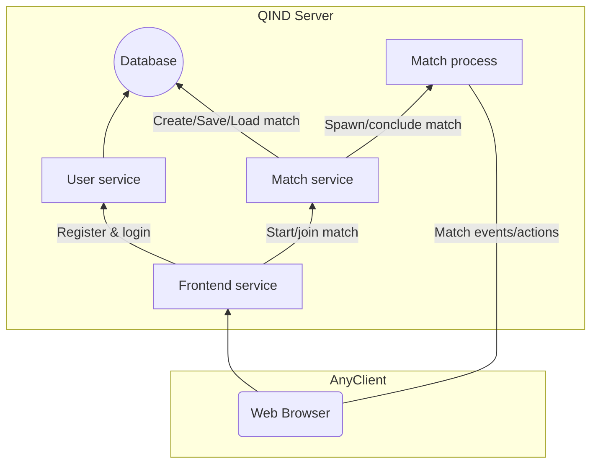

# QIND architecture overview

## Introduction

This document contains information about the general architecture of the components required to run the contest. Preview tool supporting *Mermaid* is required to view the diagrams.

## Overview

## Technologies WIP

Server: node.js  
Database: MongoDB  
Language: Typescript?  
UI: HTML5 + CSS/LESS/SASS?  
UI script: vanilla.js / node.js / typescript?  
